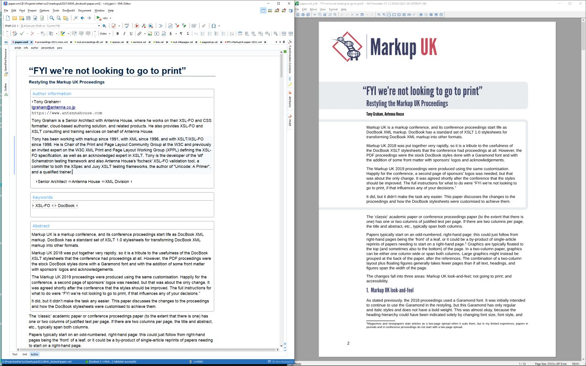

# 'MUK_docbook' add-on Oxygen framework

**MUK_docbook** is an add-on Oxygen framework for use by prospective speakers and paper writers for the Markup UK conference. It provides the **Markup UK Paper [Extension of DocBook 5]** Document Type Association for editing, validating, and formatting Markup UK Papers. The provided transformation scenarios use the same DocBook XSLT Stylesheets customisation and XSL-FO formatter as are used in the final proceedings.

## Installation

Follow the instructions in the oXygen manual at https://www.oxygenxml.com/doc/ug-editor/topics/installing-and-updating-add-ons.html

The **MUK_docbook** update site URL is https://github.com/MarkupUK/paperFramework/raw/master/updateSite.xml

Note that oXygen will warn you that the add-on is not signed. This is expected. Oxygen will also require you to restart the editor after installing the add-on framework.

## Document template

**MUK_docbook** provides a sample paper as a template.

## Project template

**MUK_docbook** provides a template Oxygen project. When you select 'MUK_docbook' when creating a new project, the generated project includes a sample paper and also has additional transformation scenarios.

## Schematron validation

**MUK_docbook** applies some extra Schematron rules when you validate your document.

## 'Markup UK Paper' Transformation Scenarios

The 'Markup UK Paper' transformation scenario makes it easy to preview how your paper will look in the Markup UK proceedings. The transformation scenario formats your paper to PDF using the same DocBook XSLT Stylesheets customisation as is used in the final proceedings.

The Markup UK proceedings are formatted using Antenna House Formatter. Accurate reproduction of the final proceedings requires that you also have a recent version of the Antenna House XSL Formatter installed and that Oxygen is configured to use it.

Other 'Markup UK Paper' transformation scenarios are:

- 'Markup UK Paper - GUI (Windows)' - On Windows only, opens the XSLT output (with `.xml_xslt` extension) in the Antenna House Formatter GUI. If Antenna House Formatter GUI is already running, the file will open in that GUI. If the transformation scenario has to start the GUI, the scenario will not terminate until the GUI is closed. If the file is already open in the GUI, the file will reopen at the current page.
- 'Markup UK Paper - FO' - Generates an XSL-FO file with `.fo` extension. The file can be opened in the Antenna House Formatter GUI or formatted with `AHFCmd` or opened in an editor, etc.

### 'Antenna House' external FO processor

The transformation scenario expects Oxygen to have an 'Antenna House' FO processor configuration that runs the Antenna House command-line formatter.

If your Oxygen is not already configured:

1. Oxygen will overwrite every current FO processor configuration in the following steps, so if desired, backup your current Oxygen global options by exporting them to a file.
1. Install Antenna House Formatter V7.3 (64-bit version) then restart Oxygen.
1. Download https://github.com/MarkupUK/paperFramework/raw/master/resources/formatter-options/formatter-options.xml
1. In Oxygen, under the **Options** menu, select **Import Global Options...**.
1. Select the `formatter-options.xml` file that you downloaded then click on **Open**.
1. When the **Import Global Options** dialog box is displayed, click on **Open**.
1. Oxygen will advise that a restart is required, but the FO processor configuration has been made already.

If you are using a different Antenna House Formatter version (for example, if these instructions have not been updated to refer to the current version), you can follow these instructions to add the FO processor configurations then edit the processor entries in the 'XML / PDF Output / FO Processors' preferences.

## 'MUK_docbook' framework and Oxygen's 'DocBook 5' framework

The **MUK_docbook** framework is an extension of Oxygen's 'DocBook 5 framework. **MUK_docbook** uses the schema from the 'DocBook 5' framework.

However, because the add-on has a higher priority than Oxygen's built-in 'DocBook 5' framework, **MUK_docbook** is used in preference to 'DocBook 5' for all DocBook 5 documents, not just for Markup UK papers. Disable the **Markup UK Paper [Extension of DocBook 5]** Document Type Association in your Oxygen preferences when you want to use the built-in 'DocBook 5' framework instead.

## Developing the 'MUK_docbook' add-on Oxygen framework

See "[Developing the 'MUK_docbook' add-on Oxygen framework](developing.md)".

## License

Copyright [2018] [Markup UK]

Licensed under the Apache License, Version 2.0 (the "License");
you may not use this file except in compliance with the License.
You may obtain a copy of the License at

http://www.apache.org/licenses/LICENSE-2.0

Unless required by applicable law or agreed to in writing, software
distributed under the License is distributed on an "AS IS" BASIS,
WITHOUT WARRANTIES OR CONDITIONS OF ANY KIND, either express or implied.
See the License for the specific language governing permissions and
limitations under the License.
