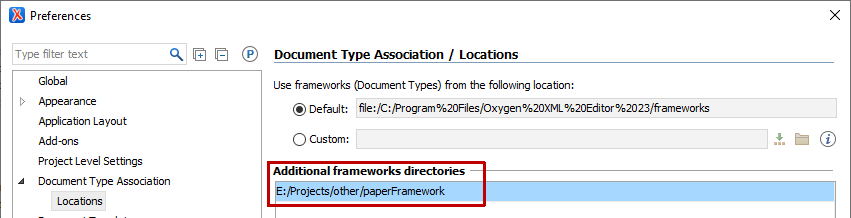
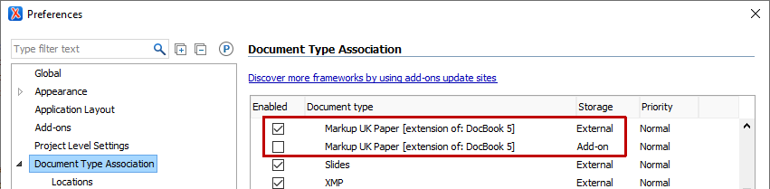

# Developing the 'MUK_docbook' add-on Oxygen framework

Developing the **MUK_docbook** framework is done on a clone of the GitHub repository. Before a release is made, the current state of the code is committed to the local repository then pushed to GitHub. (Alternatively, the code on GitHub could be modified by accepting a pull request on GitHub.)

## Installation

1. Clone the repository and its 'MUK_xsl' submodule from https://github.com/MarkupUK/paperFramework.git
   ```
   git clone --recurse-submodules  https://github.com/MarkupUK/paperFramework.git
   ```
1. In Oxygen, add the directory of the Git repository as a Document Type Association framework location:
   
1. If the **MUK_docbook** framework is also installed, disable the add-on framework and ensure that the external framework from the Git repository is enabled.
   
   
   Ordinarily, the external framework will be enabled automatically as soon as the add-on framework is disabled.

## Updating from GitHub

```
git pull --recurse-submodules origin master
```

## Modifying the framework

The framework files are in `MUK_docbook`.

The framework configuration can be modified in Oxygen by double-clicking on the **Markup UK Paper [Extension of DocBook 5]** name in the Document Type Association panel

## Modifying the template project

The source for the template project that is included in the add-on is in the `project` directory.

To modify the template project, open `project/MUK_docbook.xpr` as an ordinary Oxygen project and make changes to the project and/or files in the `project` directory.

The contents of the `project` directory are automatically included in the add-on Zip file when it is generated.

## Making a release

This requires Apache Ant.

BEFORE making a release on GitHub:
 - If `MUK_docbook/xsl` is modified, then in the `MUK_docbook/xsl` directory:
   - Commit all modified files on the `main` branch
   - Push the commits to GitHub
   - On GitHub, make a release in the 'MUK-xsl' project; for example version '1.0.0' with tag `v1.0.0`
   - In your local `MUK_docbook/xsl` directory, pull the tag for the new release; for example:
     ```
	 git pull origin v1.0.0
	 ```
	 This should not change any files, because the tag corresponds to your latest commit
   - In your `paperFramework` directory, commit the modified `MUK_docbook/xsl` directory, referring to the tag of the new release:
     ```
	 git commit -m"Update to 'MUK_xsl 1.0.0'."
	 ```
 - Commit all remaining hand-modified files
 - Make sure that `${version}` in `properties.xml` is correct
 - Run the `release` target with `-Dforce=yes`
 - Commit build.properties and the generated files with a `Releasing MUK_docbook x.y.z.` commit message
 - Push the commits to GitHub.

RELEASING on GitHub
 - From https://github.com/MarkupUK/paperFramework, click on 'Releases' in the right sidebar to go to https://github.com/MarkupUK/paperFramework/releases/
 - Click on 'Draft a new release' to go to https://github.com/MarkupUK/paperFramework/releases/new
 - In the 'Tag version' field, enter `v` followed by the `${version}` value; for example, `v1.0.0`
 - In the 'Release title' field, enter `MUK_docbook` followed by the `${version}` value; for example, `MUK_docbook 1.0.0`
 - In the 'Describe this release' field, describe this release
 - Attach the Zip file for the current release that was generated in the local `releases` folder to the issue by either dragging it to the 'Attach binaries by dropping them here or selecting them.' field or clicking on the field and then selecting the Zip file
 - Click on 'Publish release'.

AFTER making a release on GitHub:
 - Increment `${version}` in `properties.xml` so it's not possible to accidentally overwrite a release's Zip file with different versions of files.
